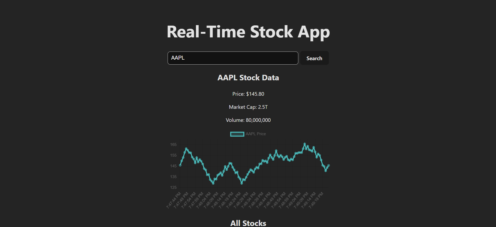

# Real-Time Stock Viewer Simulator



This project is a real-time stock viewer simulator built with **React** for the frontend and **Express** for the backend. It uses **Socket.io** to stream stock price updates dynamically, mimicking real-time stock market fluctuations.

## 🚀 Features

- **Real-Time WebSocket Communication** via **Socket.io**
- **Stock Market Simulation** with fluctuating prices
- **Search Functionality** to find specific stock data

## 🛠️ Technologies Used

### Frontend

- React.js 18
- Chart.js (for real-time line graph)

### Backend

- Express.js
- Socket.io
- Node.js

## 🔧 Setup Instructions

### Prerequisites

Make sure you have **Node.js** installed on your system.

### Clone the Repository

```sh
git clone https://github.com/tbtiberiu/real-time-stock-app.git
cd real-time-stock-app
```

### Install Dependencies

#### Backend

```sh
cd backend
npm install
```

#### Frontend

```sh
cd frontend
npm install
```

### Start the Application

#### Backend

```sh
node server.js
```

#### Frontend

```sh
npm run dev
```

The application should now be running at `http://localhost:5174`.

## 🔄 How It Works

1. The backend Express server generates and updates stock prices dynamically.
1. Socket.io is used to push real-time stock data updates to the frontend.
1. The frontend React app listens for these updates and dynamically updates the UI.
1. Users can search for specific stocks to view their real-time data and historical trends.

## 🎯 Purpose

I built this project to learn basic real-time data transfer and Socket.io.
